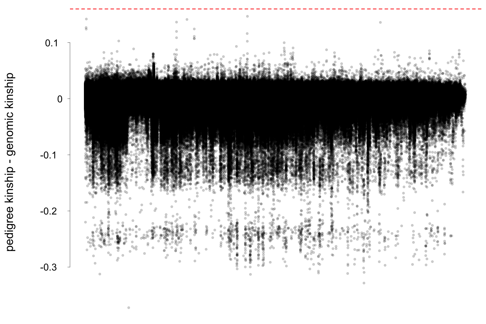

#Fixing the pedigree in the 3K owls

Due to Mendelian segregation and recombination, it is expected that genomic-based kinship will randomly vary around pedigree-based kinship. Nevertheless, large differences between both approaches are not expected and could be caused by two different factors. One of the reasons is that the pedigree is incorrect or incomplete. Due to the fact that this population is a natural population, we cannot be certain that the parents we assigned to each offspring are their true parents. For the female, this is less likely than for the male, since the female is sitting on the eggs for quite some time. Generally, when a male is seen visiting a nestbox, we assume that he is the father, but it is possible that he may simply be another male. Additionally, it is possible that some offspring are the result of extra-pair copulations. The second explanation for large differences between both kinships is that we did not sequence the individual we thought we sequenced. For purely genomic analyses, it is not a problem. However, it is a problem when phenotypic data are linked to genomic data. Therefore, after merging the Swiss owls from high and low coverages (from the GLIMPSE pipeline), we manually examined each pair of individuals for which the difference between genomic and pedigree kinship was too high.

In the following plot, we show the difference between the pedigree and genomic kinships (pedigree kinship - genomic kinship) just after the merging and before any correction.

  

If the genomic kinship is largely superior to the pedigree kinship, it indicates that our pedigree is missing links. This is likely to happen since the birds can nest outside our study area. We can’t really “fix” these links so we won’t focus on these here. What we are really interested in is when the pedigree kinship is largely superior to the genomic kinship. This either means that we did not sequence the correct individual or that the pedigree is wrong. We manually investigated the 71 pairs of individuals for which the difference between the pedigree and genomic kinship was superior to 0.16 (the pairs above the dotted red-line in figure 4). These 71 pairs included 93 individuals. Manual investigation consisted in checking if the individuals really were who we thought they were by looking at their kinship with other individuals from the same family such as siblings or offspring from different clutches. If we could not confirm the identity of the samples, we removed them from any analyses including phenotypic data. If we could confirm their identity, we kept the sample. If we found that the pedigree was wrong, we tried to identify the true parents by looking for high kinship with other individuals of the data set.

We could confirm that the individuals we sequenced really were who we thought they were for 76 individuals. We found that the pedigree was wrong in 50% of the cases. For half of these cases, we could fix the pedigree (by identifying the true parent). For 15 samples, we could not confirm that the individuals we sequenced really were who we think they were and had to remove them from any analyses using phenotypic data. We also removed 2 samples because they looked like genomic twins. Finally, we identified a three way sample swap and subsequently corrected the link between genotypic and phenotypic data.

In the following plot, we show the difference between the pedigree and genomic kinships (pedigree kinship - genomic kinship) after samples removal and manual correction of the pedigree.

  

The files contained in this folder are:

- **WeirdKinshipINDVs.list** contain the list of samples which were removed

- **ThreeSamplesSwap.list** contains the individuals which were swapped. The first column contains the initial names, the secon column contains the corrected names

- **checking_PED-vsAS_weird_kinship_3K_All3012_indvs** contains the precise description of each pair of individuals we manually investigated. Contains the Rmarkdown script and its PDF output.

- **Pedigree_Kinship_corrected.ped** contains the pedigree after manual correction

- **All3085_INDVs.list** contains the final list of individuals which can be used with phenotypic data
